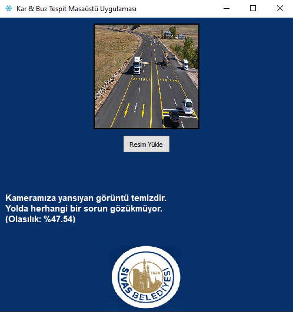
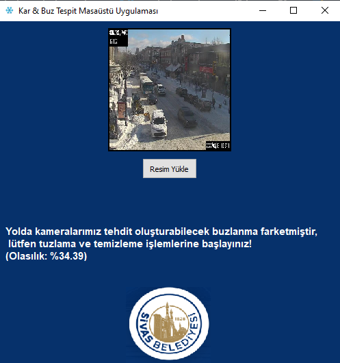
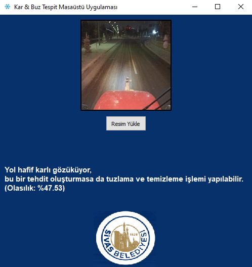

# Kar ve Buz Tespit Sistemi ❄️🛣️

Bu proje, derin öğrenme kullanarak yol yüzeylerinin durumunu dört sınıfta otomatik olarak sınıflandırmayı amaçlamaktadır:  
- `clear` (temiz)  
- `light` (hafif kar)  
- `medium` (orta yoğunlukta kar)  
- `plowed` (küreme yapılmış yol)

Proje, özellikle kış şartlarında sürüş güvenliğini artırmaya yönelik yapay zeka destekli bir çözümdür.

---

## 🧠 Kullanılan Yöntemler ve Teknolojiler

- Python
- TensorFlow / Keras
- Convolutional Neural Network (CNN)
- PyQt5 (arayüz)

---

## 📁 Veri Seti

- Toplam görüntü: 33661
- Etiketler: `clear`, `light`, `medium`, `plowed`

---

## 📊 Model Başarımı

| Metrik         | Değer  |
|----------------|--------|
| Eğitim Doğruluğu | %94    |
| Doğrulama Doğruluğu | %96    |

Model bir CNN mimarisi ile eğitildi. Veri artırma teknikleri (augmentation) kullanılarak genel başarı artırıldı.

---

## Uygulama Test

